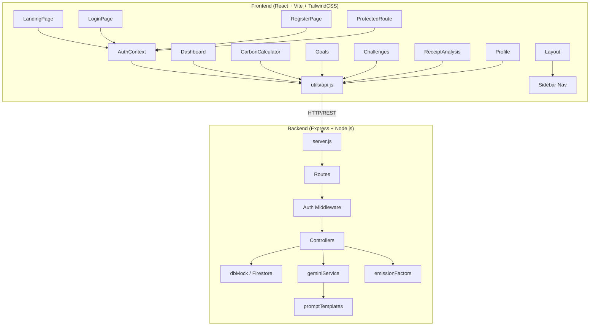

# EcoLens AI — Architecture Design

EcoLens AI is a production-grade carbon footprint tracking application. It consists of a React single-page application frontend and an Express REST API backend.

## Architecture Diagram

## Component Hierarchy & State Flow

1. **Authentication Context (`AuthContext.jsx`):** Wraps the entire application. Tracks user login/session state. Evaluates environment variables to dynamically toggle between Firebase authentication and API-based Simulation Mode.
2. **Page Components:**
   - `LandingPage`: Public-facing page explaining the product.
   - `LoginPage`/`RegisterPage`: Standard authentication handlers.
   - `Dashboard`: Aggregates summary statistics, charts (using Recharts), active goals, and carbon advisor recommendations.
   - `CarbonCalculator`: A multi-step form collecting commuting, electricity, diet, and shopping habits to calculate footprint logs.
   - `Goals`: Configures monthly carbon target reductions and tracks completion.
   - `Challenges`: Weekly sustainability tasks that users check off to earn Eco Points.
   - `ReceiptAnalysis`: Scan upload container submitting invoices/bills for visual OCR estimation.

## Backend Architecture

- **Routes:** Centralized paths representing API resources (`/api/auth`, `/api/footprint-logs`, `/api/goals`, `/api/challenges`, `/api/badges`, `/api/ocr`).
- **Controllers:** Process endpoint logic.
- **dbMock:** In simulation fallback mode, reads/writes collections to a localized `db.json` document store. In production, connects directly to GCP Firestore database.
- **Gemini Service:** Interfaces with the Google Generative AI SDK using the `gemini-1.5-flash` model for structured JSON challenge suggestions and textual recommendations.
- **Emission Factors Utility:** Simple mathematical compiler calculating carbon equivalents using EPA and DEFRA standard multipliers.
